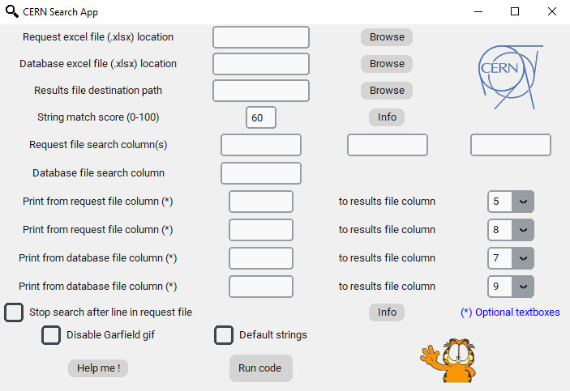
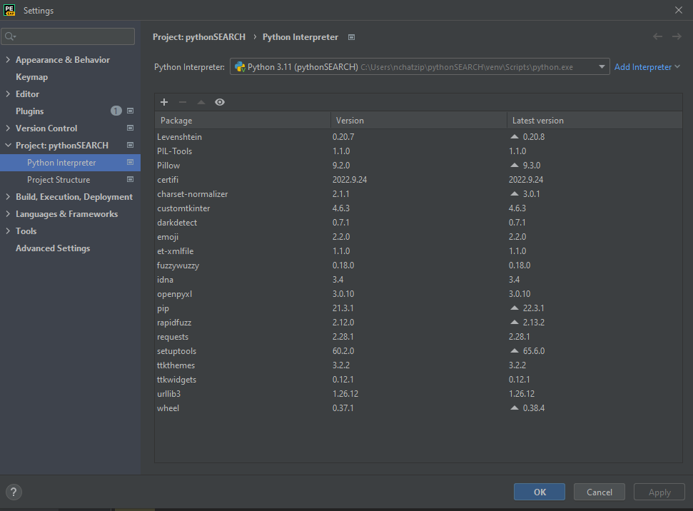

# Excel-Smart-Search-App
Application for comparing strings between two excel files. Developed for CERN TE-CRG-IC.

<!-- PROJECT LOGO -->
 

  
  <h3 align="center">Excel Search App GUI</h3>

<!-- ABOUT THE PROJECT -->
## About The Project
The repository includes the installation (.exe) file and the source code of the application.
The application was implemented for TE-CRG-IC in order to search for existing components in stores, when a new design is about to start.
  
This implementation uses:
- customtkinter library for GUI
- openpyxl library for working with excel files    
- smart fuzzywuzzy string search algorithm

<!-- GETTING STARTED -->
## Getting Started
To get started you simply have to run the installation file and complete the installation. 

### User manual
This application needs two input excel files. For example the first file contains the list of components needed for the design of a new card (altium.xlsx), and the second one an excel file with all the components which are on a specific store (store 36.xlsx). This application can use up to 3 columns of the first excel (request) file and search for the strings of these columns to the second (database) file. One column of the database file can be used. Two output excel files are produced, one contains the components founds, while the other the components not found. 

When two strings are compared, score is produced. The higher the score the more similar these strings are. Smart search algorithm is used (behaves similar to google search). User is able to define the threshold score value, suggested value is 60. Multiple suggestions for one component can be produced. For example, there might be multiple suggestions for components from database (store 36) for one component needed for our card design. Depending on the match score different coloring is implemented on the results. 

Apart from the search part some columns from input files can be printed to the produced output excel files (eg quantity requested and quantity found on the database-store). User has to properly define the column names. 

Be sure that input and output excel files are closed during the execution of the code.

### Modifing the source code
PyCharm was used for the creation of this app. In order to run the python script you need to have the following libs installed: 
 

  
  <h3 align="center">Libraries</h3>

You also have to manually replace the original library folder 'customtkinter' using the folder from this repo to your site-packages file because it has some minor modifications. Make sure all necessary gifs and photos are included. 

### Converting py to exe
- Make sure that all needed libraries are installed to your computer
- Install auto_py_to_exe application
- Open cmd and run: python -m auto_py_to_exe
- Define the main.py script location
- Select --> One Directory and Window Based (hide the console) options
- Select the 'custontkinter' location folder as an additional file
- All libraries, logos and gifs should be selected as additional files. You can simply include a folder which contains all of them
- Define output directory from settings
- Convert!

### Converting exe to installation file
You can easily do this by using [NSIS](https://nsis.sourceforge.io/Download) application. Simply convert the produced from auto_py_to_exe folder to zip and use the NSIS app. If you wish to get better - more beautiful result you can use [Advanced installer](https://www.advancedinstaller.com/). It also has an option to produce a shortcut to the desktop after installation. 

